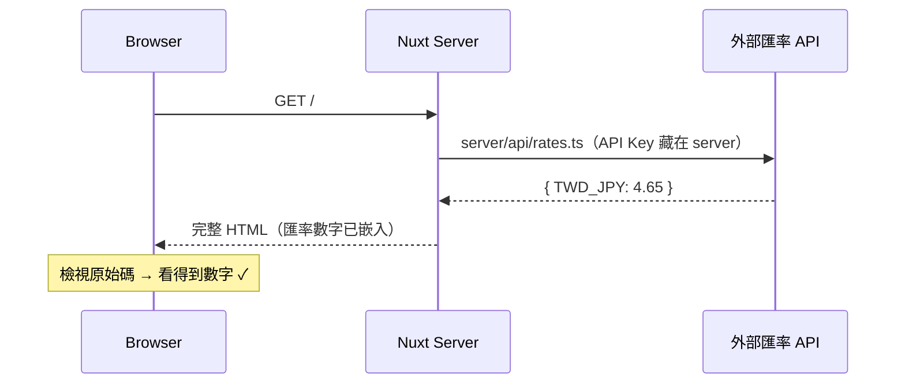
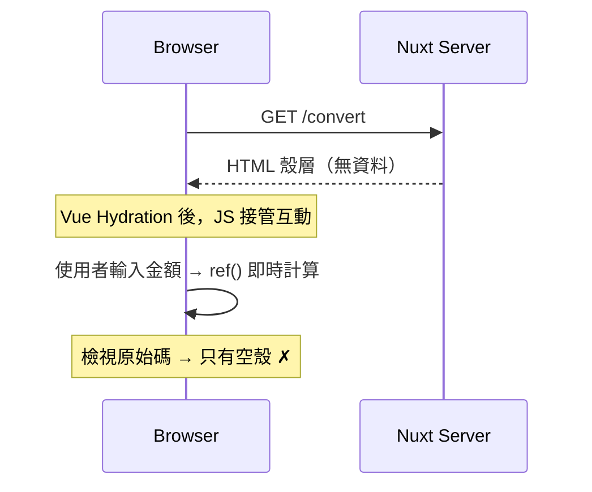
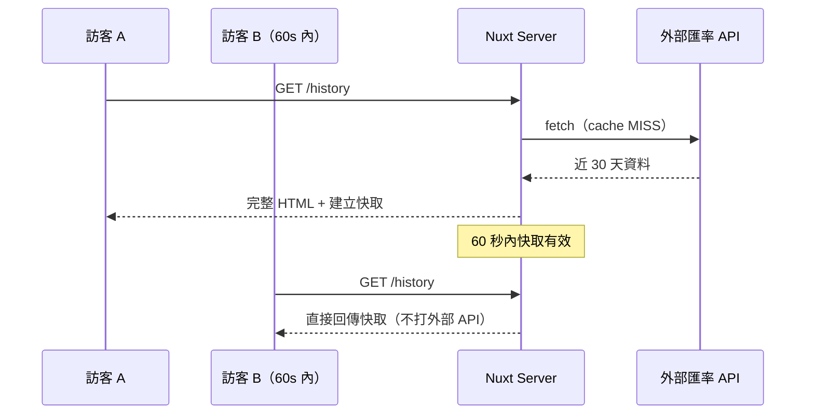

# 沖繩旅遊即時換匯 — 模組規格書 (SA Spec v1.0)

> **專案代號**：JPY-exchange
> **技術棧**：Nuxt 4 (SSR) + Nuxt UI + Pinia + Tailwind CSS 4
> **設計目標**：透過三種渲染策略（SSR / CSR / ISR）的對比，展示 Server-Side Rendering 的核心價值
> **架構決策**：無獨立後端、無資料庫。Nuxt Server Routes 即為 server 層，資料來源為外部匯率 API。

---

## 1. 商業目標與受眾

- **一句話總結**：提供台幣兌日圓的即時匯率查詢與換算，讓前往沖繩旅遊的使用者快速掌握匯率。
- **核心價值**：頁面載入即可見匯率（SEO 友善）、API Key 不外洩（server-only）、重複訪問快取回應（ISR）。
- **目標受眾**：計畫前往沖繩旅遊、需要換匯參考的台灣使用者。

---

## 2. 架構總覽

```
瀏覽器 ──→ Nuxt Server ──→ 外部匯率 API
            │
            ├── server/api/rates.ts     （藏 API Key、server-only）
            ├── server/api/history.ts   （同上）
            └── pages/*.vue             （SSR / CSR / ISR 各一頁）
```

**為什麼不需要獨立後端？**

Nuxt 的 `server/` 目錄本身就是一個跑在 Node.js 上的 server。它能：
- 讀取 `runtimeConfig` 裡的私密金鑰（不送到瀏覽器）
- 代理外部 API 請求
- 被 `useAsyncData()` 在 SSR 階段直接呼叫

等同於一個輕量版的 BFF（Backend for Frontend），不需要再起 Express / NestJS。

---

## 3. 頁面路由與渲染策略

| 路由 | 頁面名稱 | 渲染策略 | Nuxt 機制 | 教學重點 |
|---|---|---|---|---|
| `/` | 即時匯率首頁 | **SSR** | `useAsyncData()` | 原始碼可見資料、SEO 可索引 |
| `/convert` | 換匯計算機 | **CSR** | `ref()` + client-side 計算 | 對比：原始碼看不到動態結果 |
| `/history` | 歷史匯率走勢 | **ISR** | `routeRules: { isr: 60 }` | Server 快取 60 秒，兼顧即時性與效能 |

### 路由規則配置

```ts
// nuxt.config.ts
routeRules: {
  '/history': { isr: 60 }
  // / → 預設 SSR（每次請求 server 取資料）
  // /convert → 預設 SSR，但頁面內容為純 client 互動
}
```

---

## 4. 業務流程

### 4.1 即時匯率（SSR）



### 4.2 換匯計算機（CSR 對比）



### 4.3 歷史匯率（ISR）



---

## 5. Server Route 介面合約

### 5.1 GET `/api/rates` — 即時匯率

```json
{
  "base": "TWD",
  "target": "JPY",
  "rate": 4.65,
  "inverse": 0.2151,
  "updatedAt": "2026-04-16T10:30:00Z"
}
```

### 5.2 GET `/api/history?days=30` — 歷史匯率

| 參數 | 型別 | 預設 | 說明 |
|---|---|---|---|
| `days` | number | 30 | 查詢天數（上限 90） |

```json
[
  { "date": "2026-04-16", "rate": 4.65 },
  { "date": "2026-04-15", "rate": 4.63 },
  { "date": "2026-04-14", "rate": 4.67 }
]
```

### 5.3 TypeScript 型別

```ts
// types/exchange.ts

interface ExchangeRate {
  base: string
  target: string
  rate: number        // 1 TWD = ? JPY
  inverse: number     // 1 JPY = ? TWD
  updatedAt: string
}

interface HistoryRate {
  date: string        // "YYYY-MM-DD"
  rate: number
}
```

---

## 6. 目錄結構

```
server/
  api/
    rates.ts                  # GET /api/rates（代理外部 API）
    history.ts                # GET /api/history

types/
  exchange.ts                 # ExchangeRate, HistoryRate

stores/
  exchange.ts                 # Pinia store（計算機頁的 client 狀態）

app/
  pages/
    index.vue                 # 即時匯率（SSR 示範）
    convert.vue               # 換匯計算機（CSR 示範）
    history.vue               # 歷史匯率（ISR 示範）
  components/
    exchange/
      RateCard.vue            # 匯率卡片
      ConverterForm.vue       # 換算表單
      HistoryChart.vue        # 歷史走勢（簡易 CSS bar 或表格）
```

---

## 7. SSR vs SPA 驗證清單

| 驗證方式 | SSR 頁（`/`） | CSR 頁（`/convert`） |
|---|---|---|
| 右鍵 → 檢視原始碼 | HTML 裡看得到匯率數字 | 只有空的 `<div>` |
| `curl http://localhost:3000/` | 回傳含資料的完整 HTML | — |
| 停用 JavaScript → 重新整理 | 首頁仍可見匯率 | 計算機頁空白 |
| Chrome Network → Doc | TTFB 後即可見內容 | 需等 JS 下載執行 |

---

## 8. 風險提示

| 風險 | 緩解策略 |
|---|---|
| 外部匯率 API 掛掉 | server route 回傳降級提示 |
| API Key 外洩 | 僅放 `runtimeConfig`（非 `public`），永不送至 client |
| ISR 快取期間匯率波動 | TTL 60 秒，可接受範圍 |
